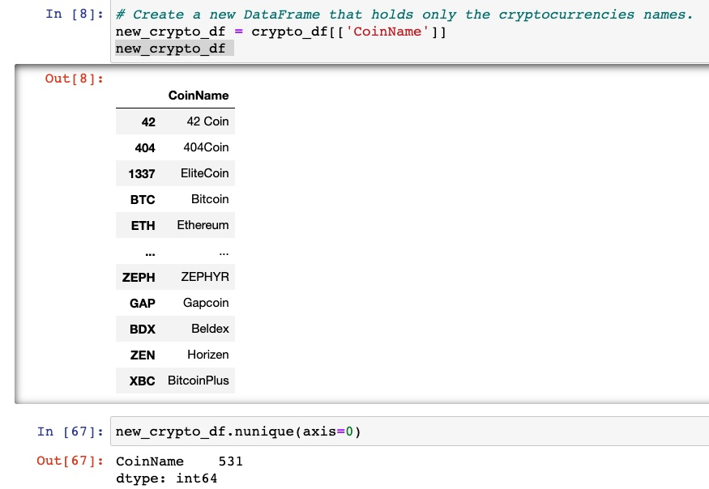

# Cryptocurrencies_challenge

## Overview

The purpose of this project was to analyze cryptocurrencies using unsupervised machine learning. The data was processed using a clustering algorithm to determine what cryptocurrencies are on the trading market and how they could be grouped to create a classification system.

This assignment consists of four technical analysis:

1: Preprocessing the Data for PCA.
2: Reducing Data Dimensions Using PCA.
3: Clustering Cryptocurrencies Using K-means.
4: Visualizing Cryptocurrencies Results.

## Results

After preprocessing the dataset, we found out that there are 531 tradable cryptocurrencies.

